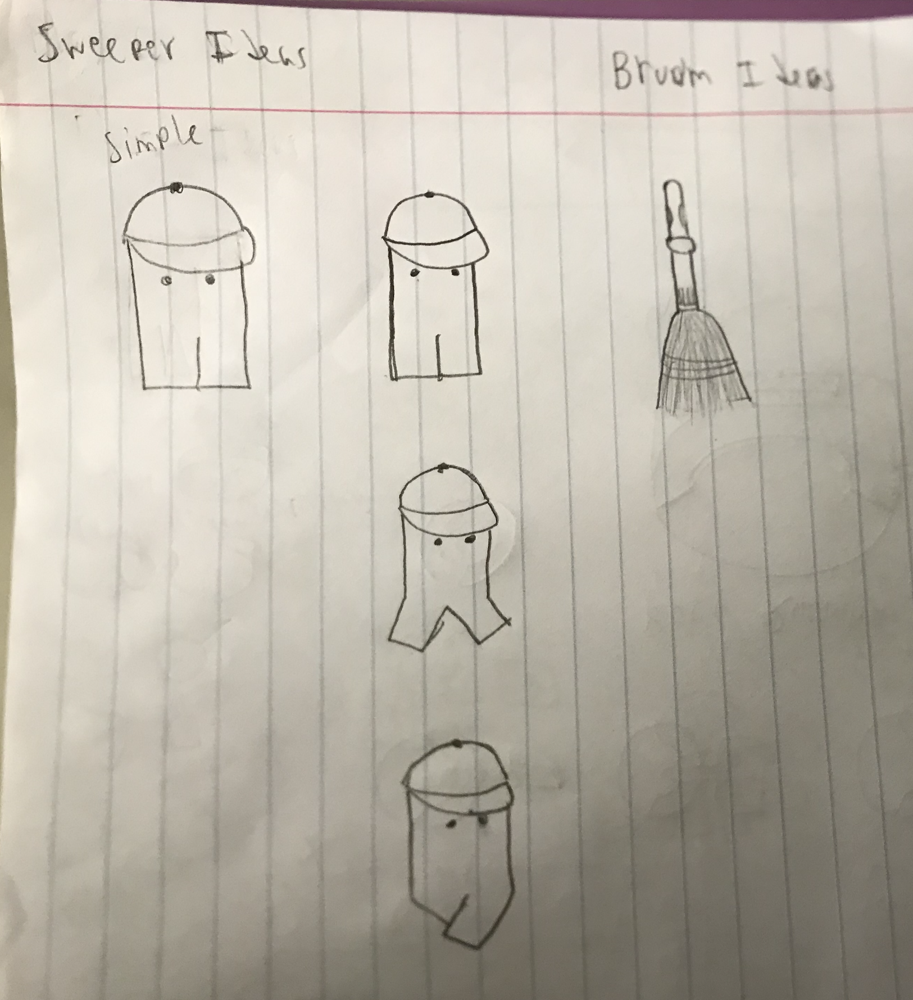
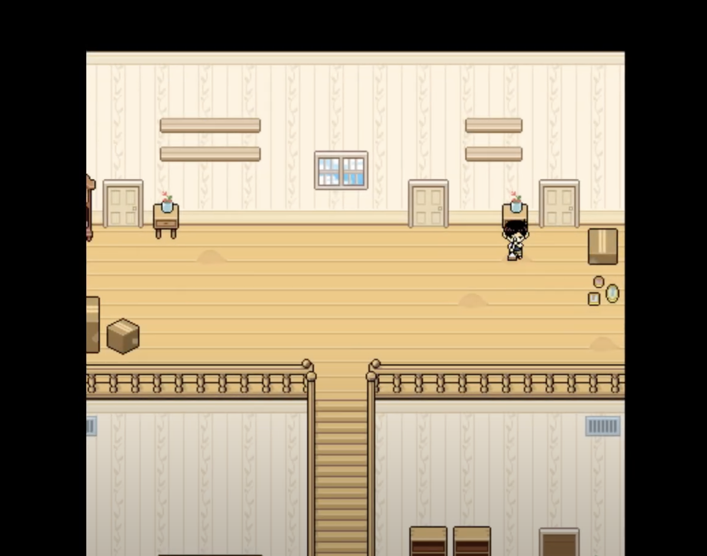
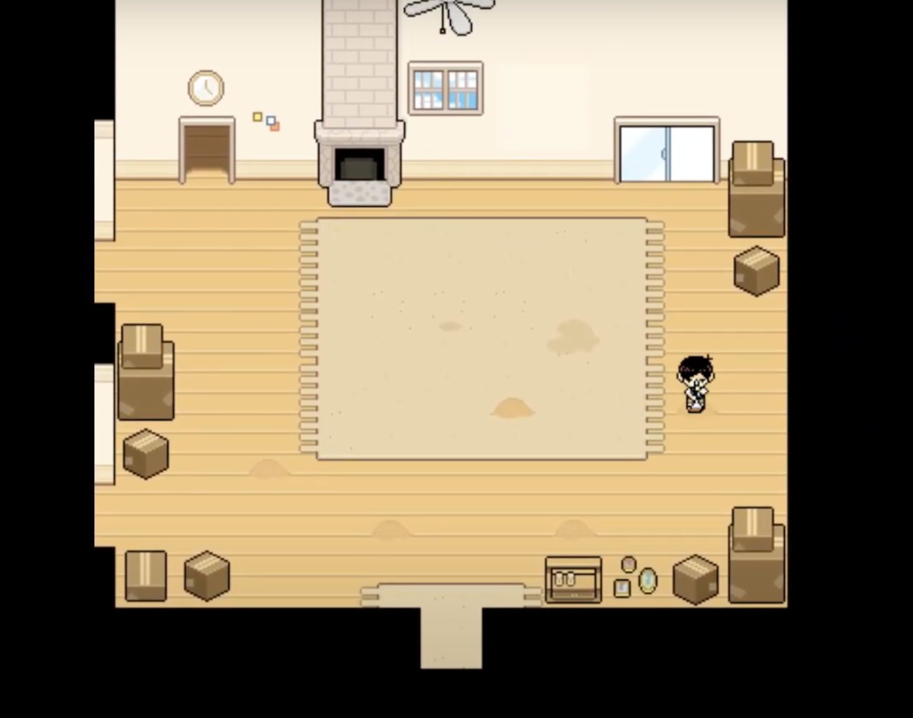
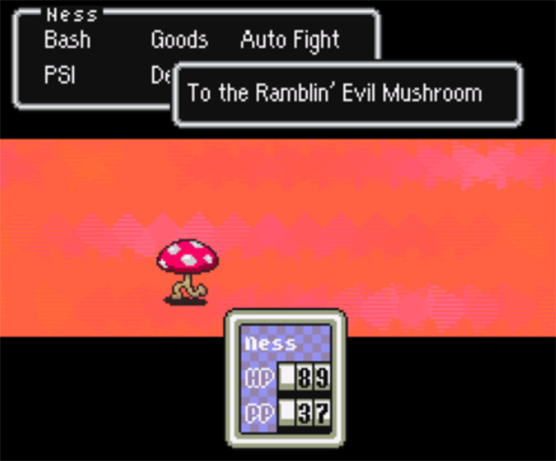
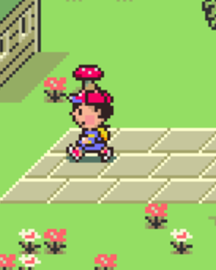

# Roomba Rampage Design Document
Nolan Kelley, Matthew Adner, and Olivia Riley.

(Roomba Rampage is a working title)

## Context and Genre
Roomba Rampage is a top down, action game.

The premise of Roomba Rampage is that you are a proffesional sweeper whose job is to clean peoples houses. However, a recent invention, the Roomba, is stealling all your business by cleaning peoples houses automatically! You must reclaim your job by cleaning more efficiently than you ever have before (and maybe destroying a few Roombas while you're at it!)

## States
### `start` state:
The game could open in a `start` state, which would include a title screen and a button promting the player to begin the game. (This state could be reused as an end screen when the player dies or reaches the end by altering the text on the buttons.)

### `running` state:
Once begun, the game would enter a `running` state, in which the actuall game takes place. 

## The Player
The sweeping character (the guy with the broom) is the player character.

### Controls:
The player controlls the sweeper with the following inputs.
* The WASD keys command the sweepers movement, allowing them to move in all cardinal directions. 
* The arrowkeys command the sweepers attacks, allowing them to swing their broom in all cardinal directions.
* The space key commands the sweeper to clean, allowing them to clean up messes in each room.
    * The player can't move or attack while sweeping. (Might be able to cancel out of it though.)

### Animation:
The sweeper's animation will be very similar to the squig character's animation I did for the platforming game. The main difference will be that the frame which is shown will be dependant on a timer that goes while the player is moving and resets when they're stationary. 

### Damage and HP:
The player will take damage uppon collision with certain objects (mainly Roombas) which will decrease their HP.

A simple meter at the bottom left of the screen display how much HP the player has by checking what values the HP is greater/less than and selecting a corresponding sprite. 

The meter could be represented with:
1) Hearts
2) Brooms
3) Roombas

Once the meter is empty, the player dies and the game ends.

### The Broom:
The broom will be the the sweeper's weapon of choice and will likely be it's own, separate object.

A point near the end of the handle of the broom should be considered the centerpoint of the sprite for rotation and position purpouses.

While the game is running, the position of the centerpoint of the broom will match that of the sweeper so it's always in their hands. 

When the player attacks, the Broom sprite will rotate around the point on the handle so that the broom faces the direction of the attack. Then the hitbox of the Broom will be activated and will be able to damage Roombas.

(This might not be implemented) When the player attempts to clean a mess, a cleaning animation will play. The broom will be pointed down, the centerpoint of the broom will temporaraly rise above it's usual spot relative to the sweeper, and the broom will slightly rotate around the centerpoint to simulate sweeping back and forth.

## The Roombas
Throughout the game, Roombas will be the main enemies/antagonists faced by the player. 

### Roomba Class:
Because the requirements for the physics of Roombas has so much in common with the physics of boids, Roombas will be made as a subclass of the `BeakBall` class, imported from `flocking_character.py`.

### Generall Roomba Rules:
There will be various variations of Roombas, but generally each Roomba will:
* Clean messes when colliding with them for a certain ammount of time uninterrupted.
* Damage the player on contact.
* Have a maximum HP.
* Take lose HP and take knockback (based on direction of swing) when contacted by the broom.
    * Knockback done by adding velocity in that direction for a bit then abruptly stopping.
    * (I would love to calculate friction and have the Roomba slide to a halt after being hit, but we need to have a chance of finishing this by the deadline.)
* Transition into a `broken` state after HP goes below 0.
    * Roombas in `broken` state can be picked up by sweeper to increase score.

### Possible Roomba variations:
A finite state machine or subclasses will be used to make various types of Roombas. These are some ideas:
* Normal Roombas
    * Randomly loop around.
* Homing Roombas
    * Seek player and/or messes.
    * Might requre A star.
* MushRoombas
    * Reverses player controls on contact.
* Weaker Roombas 
    * Enter `dased` state for a bit after hit.
* Boss Roomba
    * larger
    * more health

Variations could be denoted visually by:
* Color
* Size
* Different sprites

### Roomba Animation:
Each Roomba type will only have one sprite. Thus, most Roombas will be animated by rotating the sprite to face the direction of the Roombas total velocity at any given time. 

## Messes
Each room/house will contain a series of messes. All messes for a level will exist in a list. Once a mess is fully cleaned, it is removed from the list and thus the level.

When cleaned by the sweeper, the player gains points.

When cleaned by Roombas, the player looses/misses out on points.

## Levels
There are two main ways that levels could work in Roomba Rampage.

### Single Rooms:
Each level could pertain of only one room with messes and Roombas and once the messes are clear you move on to the next level. 

This would be relatively easy to implement but is less much less interesting.

### Houses:
Each level could pertain of an entire house. The player would need to clean all the messes in every room of the house in order to move on.

This would be much more fun and interestinf, but it would require being able to move between screens while having the game remember everything that's occured in each room.

## Endings
Roomba Rampage might have various different endings based on the following factors:
* If the player dies or reaches the end.
    * Ending where you get eaten by a Roomba.
* What score the player has at the end.
    * low - Ending where you scrape by and make a living.
    * mid - Ending where you're well off and don't need to worry too much about Roombas.
    * high - Ending where you fully triumph over Roombas, sending them into obscurity and saving not only your job, but the jobs of all other cleaners world wide!
* If the player avoids damaging Roombas.
    * Ending where you befriend the Roombas.

## Concept Art
Concept Art for Roomba Rampage
(Sorry about the blur, my phone's camera is nearing it's end.)
### The Sweeper Character and Their Broom:

### Various Roombas:

### A Room and Some Objects:

## Development
For the most part, we will work on this game in person together. We'll keep the code on Nolan's computer, but keep an updated Git repository incase plans change.

## Potential Development Challenges

### The Broom Animation:
Getting the broom to rotate could very easily be much harder than it currently seems. If that's the case, we might scrap the idea of rotating the broom and just make multiple sprites, one for each direction attack.

### Roomba Animation:
If this has the same potential problem as the broom, we could just not animate the Roombas at all.

### Levels/Rooms:
I don't think any one of us has made a game with multiple rooms or multiple levels, let alone one with multiple levels each holding multiple rooms. 

These are things we would likely need to do to make this work:

1) Level Class
    * List of rooms in each level.
    * A set first room and a current room index variable.
    * Methods that call methods of current room.
2) Room Class
    * Roomba and Mess lists.
    * List of doorways in the room.
    * Method that updates everything in the room.
    * Method that draws everything.
3) Doorway Class
    * Position vector and sprite (one of four).
    * Index of room (in list of rooms) that this doorway goes to (manually done).
    * Method that changes current room to the room at the index above in the room list.
4) In file that runs game
    * List of levels. 
    * A set first level and a current level index variable.
    * Code to run calling methods of the current level.

Even if we did do all of this, we would still need to create all of the levels, which will also take a lot of work. This is definately something that may be scrapped for a simpler level system.

## Inspirations/Refrences

### The cleaning aspect of the game is heaivly inspired by the "Sweeping the House" minigame from the Hikikomori rout of Omori.

### The MushRoomba and its effect are inspired by the Ramblin' Evil Mushroom enemy from the Mother series.

### The movent and attack controlls, as well as the room designs, are heaivly ispired by those of The Binding of Isaac: Rebirth.
